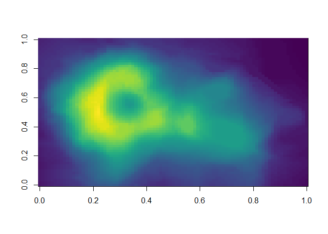
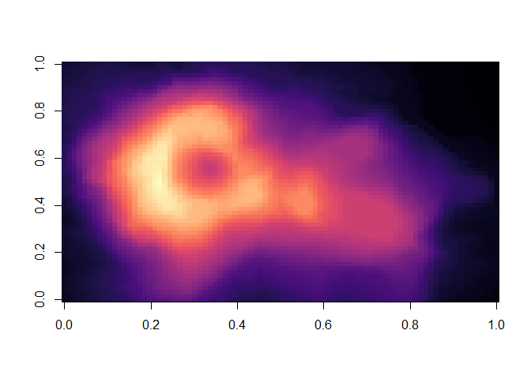

The code below demonstrates two colour palettes in the
[viridis](https://github.com/sjmgarnier/viridis) package. Each plot
displays a contour map of the Magma Whau volcano in Auckland, NZ.

Viridis colours
---------------

    image(volcano, col = viridis(200))

Mgma colours
------------

    image(volcano, col = viridis(200, option = "A"))

